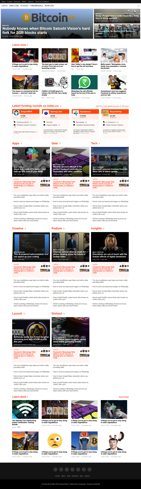
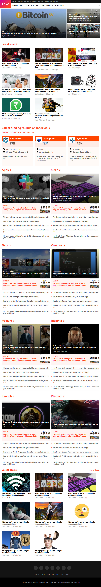
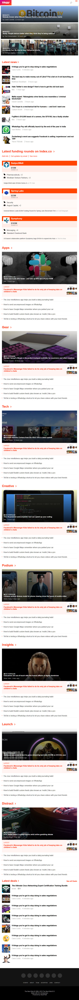

# Building with Responsive Design

This is a project of the Main HTML/CSS curriculum at Microverse - @microverseinc.

- This project consists of replicating the [The Next Web](https://thenextweb.com/) website putting emphasis on how it behaves differently depending on the size of the screen where the website is rendered.
- The project was completed using simple html and css.

[Assignment link](https://microverse.pathwright.com/library/fast-track-curriculum/69047/path/step/59540217/)

Authors:

- [@BenjaminGarza](https://github.com/BenjaminGarza)
- [@MauricioRobayo](https://github.com/MauricioRobayo)
